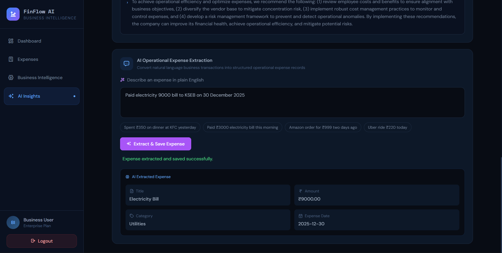
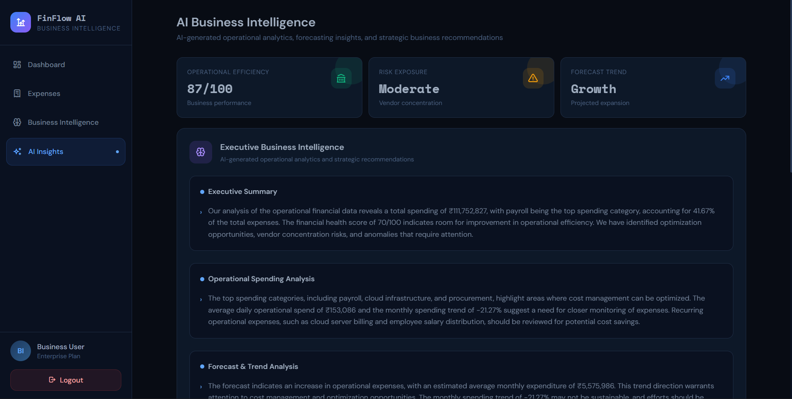

# FinFlow AI — AI-Powered Expense Analyzer

## Overview

FinFlow AI is a full-stack AI-powered expense analysis platform that helps users track expenses, analyze spending behavior, and generate intelligent financial insights using Large Language Models (LLMs).

The application combines:

* AI-powered natural language expense extraction
* Financial analytics and spending summaries
* Cloud deployment and CI/CD automation
* Full-stack frontend and backend architecture

The project was built to explore real-world software engineering practices including:

* Version control
* Code quality enforcement
* Automated testing
* Continuous Integration/Continuous Deployment (CI/CD)
* Cloud infrastructure deployment
* Dockerized backend deployment
* AI integration workflows

---

# Features

## Expense Management

* Create expenses manually
* Update existing expenses
* Delete expenses
* Search and filter expenses
* Category-based expense tracking

## AI Expense Extraction

Users can describe expenses in natural language:

Examples:

* "Spent ₹350 on dinner yesterday"
* "Paid ₹220 for Uber ride"
* "Amazon order for ₹999"

The AI system extracts:

* Title
* Amount
* Category
* Expense date

## Financial Analytics

* Total spending
* Top spending category
* Average daily spending
* Category breakdown visualization
* Weekly spending trends
* Financial health score

## AI Financial Insights

The AI engine analyzes:

* Spending behavior
* Financial discipline
* Risk observations
* Budget patterns
* Recurring spending habits
* Personalized financial suggestions

## Production Infrastructure

* Dockerized backend
* AWS EC2 deployment
* Nginx reverse proxy
* Automated CI/CD pipeline
* GitHub Actions deployment automation

---

# Tech Stack

## Frontend

* React
* Vite
* Tailwind CSS
* Axios
* Recharts

## Backend

* FastAPI
* SQLAlchemy
* Pydantic
* SQLite

## AI Integration

* Groq API
* Llama 3.3 70B

## DevOps & Cloud

* Docker
* GitHub Actions
* AWS EC2
* Nginx
* Linux (Ubuntu)

## Testing & Code Quality

* pytest
* pylint

---

# System Architecture

```text
React Frontend (Vercel)
        ↓
Nginx Reverse Proxy
        ↓
FastAPI Backend (Docker Container)
        ↓
SQLite Database
        ↓
Groq AI API
```

---

# CI/CD Pipeline

The project implements automated Continuous Integration and Continuous Deployment using GitHub Actions.

## CI Flow

```text
Git Push
   ↓
GitHub Actions
   ↓
Run pytest
   ↓
Run pylint
   ↓
Validate Build
```

## CD Flow

```text
Git Push
   ↓
GitHub Actions
   ↓
SSH into AWS EC2
   ↓
Pull latest code
   ↓
Rebuild Docker container
   ↓
Restart FastAPI application
```

---

# Project Structure

```text
ai-expense-analyzer/
│
├── app/
│   ├── api/
│   ├── core/
│   ├── db/
│   ├── models/
│   ├── schemas/
│   ├── services/
│   └── utils/
│
├── tests/
├── finflow/
├── .github/workflows/
├── Dockerfile
├── pyproject.toml
├── main.py
└── README.md
```

---

# Local Development Setup

## Backend Setup

### Clone Repository

```bash
git clone <repository-url>
cd ai-expense-analyzer
```

### Install Dependencies

```bash
uv sync
```

### Configure Environment Variables

Create a `.env` file:

```env
GROQ_API_KEY=your_groq_api_key
```

### Start Backend

```bash
uv run uvicorn main:app --reload
```

Backend runs on:

```text
http://127.0.0.1:8000
```

---

## Frontend Setup

```bash
cd finflow
npm install
npm run dev
```

Frontend runs on:

```text
http://localhost:3000
```

---

# Docker Deployment

## Build Docker Image

```bash
sudo docker build -t ai-expense-analyzer .
```

## Run Container

```bash
sudo docker run -d \
-p 8000:8000 \
--env-file .env \
--name ai-expense-app \
ai-expense-analyzer
```

---

# AWS EC2 Deployment

The backend is deployed on:

* Ubuntu EC2 instance
* Docker containerized environment
* Nginx reverse proxy

Deployment includes:

* Automated GitHub Actions deployment
* Docker rebuild automation
* Production container restart
* Reverse proxy routing

---

# Testing

## Run Unit Tests

```bash
uv run -m pytest
```

## Run Pylint

```bash
uv run pylint app
```

---

# API Endpoints

## Expense APIs

* `GET /expenses`
* `POST /expenses`
* `PUT /expenses/{id}`
* `DELETE /expenses/{id}`

## Analytics APIs

* `GET /analytics/summary`

## AI APIs

* `GET /ai/summary`
* `POST /nlp/extract-expense`

---

# Key Engineering Learnings

This project helped explore:

## Software Engineering

* Full-stack architecture
* API design
* State management
* Modular backend structure

## DevOps & Deployment

* Docker containerization
* Linux server management
* AWS EC2 deployment
* Reverse proxy architecture
* CI/CD automation

## AI Engineering

* LLM integration
* Prompt engineering
* Structured JSON extraction
* AI-powered analytics

## Code Quality

* Unit testing with pytest
* Static analysis using pylint
* CI validation workflows

---

# Future Improvements

Potential future enhancements:

* User authentication
* PostgreSQL migration
* HTTPS + SSL setup
* Budget tracking system
* Recurring expense detection
* Export reports (PDF/Excel)
* Kubernetes deployment
* Monitoring and logging

---

## Screenshots

### Dashboard

*Overview of total spending, top categories, and financial health score.*

### Expense Management

*Interface for adding, editing, and tracking individual expenses.*

### NLP Extraction Feature

*AI automatically parsing natural language text into structured expense data.*

### AI Insights

*Personalized financial suggestions and spending pattern analysis.*

---

# Author

Jeswin K Reji

---

# License

This project is for educational and portfolio purposes.
